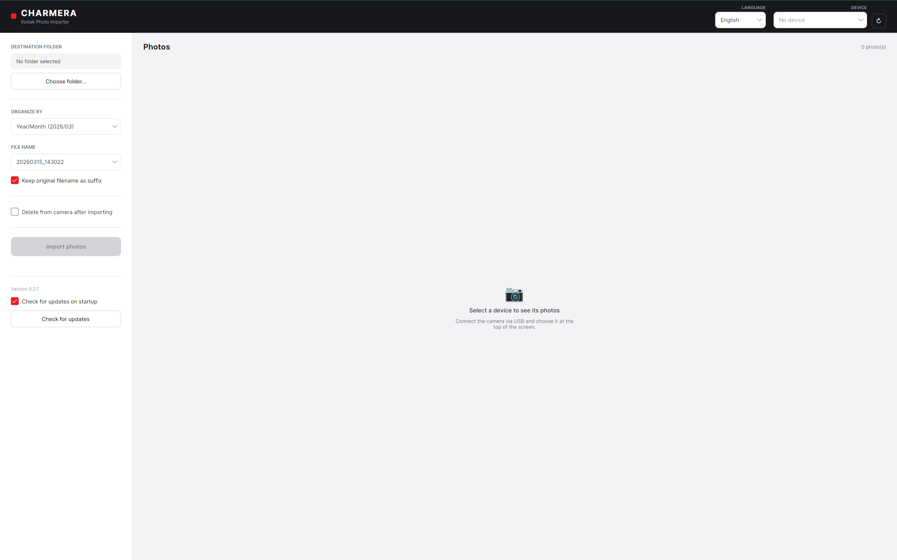

# Charmera Importer

A desktop app for importing photos from a Kodak camera (or any USB mass-storage
device) with automatic EXIF-based organization and duplicate detection.

[](https://github.com/RickCaleg/charmera-importer/actions/workflows/ci.yml)
[](https://github.com/RickCaleg/charmera-importer/releases/latest)




## About

Charmera Importer was built to solve a small, specific annoyance: getting
photos off a Kodak point-and-shoot camera (which mounts as a plain USB drive)
without manually hunting through `DCIM` folders, renaming files by hand, or
accidentally re-copying photos that were already imported.

It lists removable USB drives, shows the photos on the selected one as
thumbnails, lets you pick a destination folder, a folder structure, and a
file-naming pattern, then imports everything — skipping anything that's
already been imported before, based on file content, not just the filename.

## Features

- **Removable device detection** — lists USB mass-storage devices on Linux and
  Windows so you can pick the right one (no more guessing which mount point is
  the camera).
- **Thumbnail browser** — scans the device's `DCIM` folder and shows photos as
  a grid of thumbnails, loaded progressively in the background.
- **EXIF metadata** — reads camera make/model, capture date, dimensions, and
  the full EXIF tag dump for each photo (when the camera actually writes it —
  see [Known limitations](#known-limitations)).
- **Flexible organization** — choose how imported photos are organized:
  by year/month, year/month/day, by camera model, or a single flat folder.
- **Configurable file naming** — rename files based on capture date/time, with
  the option to keep the original filename as a suffix.
- **Duplicate detection** — every imported file is hashed (SHA-256) and
  recorded in a local history, so re-running an import (e.g. with an
  unformatted card) never creates duplicate copies.
- **Remembers your preferences** — destination folder, organization scheme,
  naming preset, and language are saved automatically and pre-selected the
  next time you open the app.
- **Copies by default, deletes only if you ask** — files are always copied
  from the camera. An explicit, always-off-by-default checkbox lets you also
  delete already-imported photos from the camera afterward, for people who
  want to clear the card as they go.
- **Self-updating** — checks GitHub Releases on startup (can be turned off), shows a
  banner when a new version is out, and installs it with one click after verifying the
  download's SHA-256 checksum.
- **Language selection** — the UI auto-detects a supported language from the
  OS locale on first run (currently English and Portuguese), and remembers
  your choice if you change it from the picker in the header.

## Installation

Download the latest version from the
**[Releases page](https://github.com/RickCaleg/charmera-importer/releases/latest)**.
All builds are self-contained — no .NET installation needed.

| Platform | File | Updates |
|---|---|---|
| Windows 10/11 (x64) | `charmera-importer-<version>-win-x64-setup.exe` | Automatic, from inside the app |
| Linux (x64), any distro | `charmera-importer-<version>-linux-x64.tar.gz` | Automatic, from inside the app |
| Debian / Ubuntu | `charmera-importer_<version>_amd64.deb` | Download the new `.deb` (the app tells you when) |
| Fedora / openSUSE | `charmera-importer-<version>-1.x86_64.rpm` | Download the new `.rpm` (the app tells you when) |

**Windows:** run the setup. It installs for your user only, so no administrator prompt.
Windows SmartScreen may warn that the publisher is unknown, because the installer isn't
code-signed. Choose *More info → Run anyway*.

**Linux (portable):** extract it somewhere you own, such as `~/Applications/charmera-importer`,
and run `./charmera-importer`. The folder must stay writable by you for self-update to
work. The tarball also contains a `.desktop` file and icon if you want a menu entry.

**Linux (.deb/.rpm):**

```bash
sudo apt install ./charmera-importer_<version>_amd64.deb     # Debian/Ubuntu
sudo dnf install ./charmera-importer-<version>-1.x86_64.rpm  # Fedora
```

You can verify any download against `SHA256SUMS` from the same release
(`sha256sum -c SHA256SUMS --ignore-missing`).

## Tech stack

- [.NET 10](https://dotnet.microsoft.com/) / C#
- [Avalonia UI](https://avaloniaui.net/) (cross-platform desktop UI)
- [CommunityToolkit.Mvvm](https://learn.microsoft.com/dotnet/communitytoolkit/mvvm/) for MVVM
- [MetadataExtractor](https://github.com/drewnoakes/metadata-extractor-dotnet) for EXIF parsing

## Getting started

### Prerequisites

- [.NET 10 SDK](https://dotnet.microsoft.com/download)
- Linux or Windows (see [Platform support](#platform-support))

### Build, test, and run

```bash
git clone https://github.com/RickCaleg/charmera-importer.git
cd charmera-importer
dotnet test charmera-importer.slnx
dotnet run --project charmera-importer/charmera-importer.csproj
```

Development builds never replace themselves. The update banner only links to the release
page. See [packaging/README.md](packaging/README.md) for how releases are built.

## Usage

1. Connect your camera (or any USB drive) and select it from the **Dispositivo**
   dropdown at the top of the window.
2. Photos found on the device (under its `DCIM` folder, if present) appear as
   thumbnails, with EXIF details filling in as they're read.
3. Click a photo to see its EXIF details in the right-hand panel.
4. Pick a destination folder, a folder organization scheme, and a file-naming
   preset in the left sidebar.
5. Click **Importar fotos**. Already-imported photos (matched by content hash,
   not filename) are automatically skipped and marked as duplicates.

## Platform support

| Platform | Status |
|---|---|
| Linux | Fully tested, including with a real Kodak camera |
| Windows | Implemented (`DriveInfo`-based device detection + native folder picker), built and unit-tested in CI; not yet tested by hand on real Windows hardware |

Device detection on Linux works by reading `/proc/mounts` and `/sys/block/*/removable`
to find removable volumes mounted under `/media` or `/run/media` — the standard
layout on most Linux desktops.

## Known limitations

- Some cameras (including the Kodak PixPro this app was built against) don't
  write make/model/date to EXIF at all — the app falls back to the file's
  modification date for naming/organizing, and simply hides EXIF fields it
  doesn't have data for, rather than showing them blank.
- Thumbnails aren't generated for RAW formats (`.cr2`, `.nef`, `.arw`, `.dng`) —
  EXIF is still read for these, just no preview image.
- Automated tests cover the pure logic (path/naming rules, update version and checksum
  handling), not the UI or device detection. Those are still verified by hand.
- Only English and Portuguese are translated so far — see `Localization/Translations.cs`
  to add another language (it's just a dictionary of strings per language code).

## Project structure

```
charmera-importer/
├── Models/         # Plain data types (RemovableDevice, PhotoImportCandidate, ImportSettings, ...)
├── Services/       # Device detection, scanning, EXIF, thumbnails, hashing, import pipeline
├── ViewModels/     # MVVM view models (CommunityToolkit.Mvvm)
├── Views/          # Avalonia XAML views
├── Styles/         # Shared visual theme (colors, control styles)
└── Localization/   # Language detection/persistence and the {loc:Loc Key} XAML markup extension
tests/              # xUnit tests
packaging/          # nfpm (.deb/.rpm) config, Inno Setup script, .desktop file
.github/workflows/  # CI (build + test) and release (build + publish all installers)
```

## AI disclosure

This project was built with substantial assistance from **[Claude Code](https://claude.com/claude-code)**
(Anthropic's AI coding agent) — including architecture and implementation of
the services/view-model layers, the EXIF/duplicate-detection pipeline, and the
visual redesign of the UI. All AI-assisted work was directed, reviewed, and
tested by the project author, including manual end-to-end verification against
a real, physically connected Kodak camera. If you find a bug or something that
looks off, please open an issue — it's genuinely useful feedback regardless of
how a given line of code came to exist.

## Contributing

Issues and pull requests are welcome — see [CONTRIBUTING.md](CONTRIBUTING.md).

## License

MIT — see [LICENSE](LICENSE).
